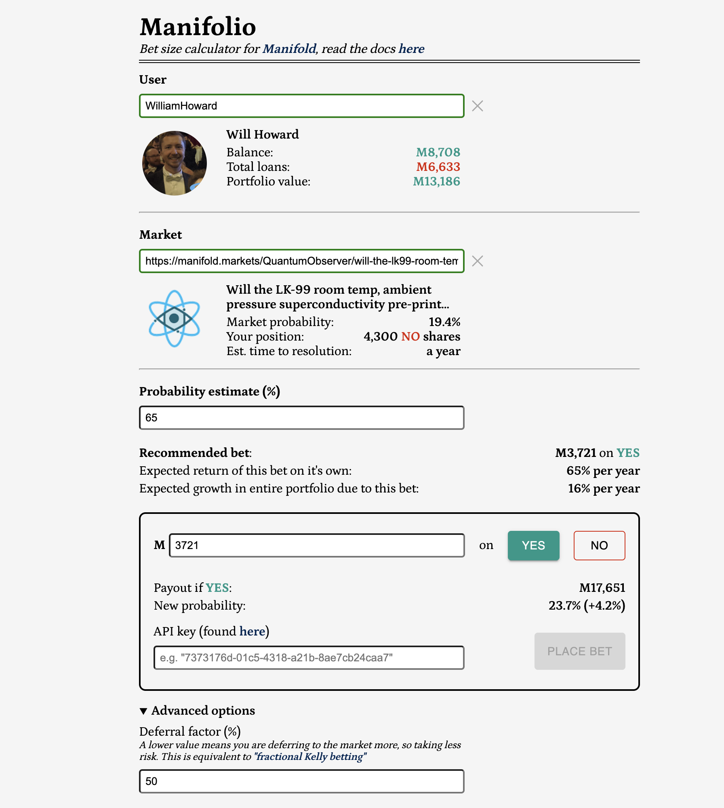
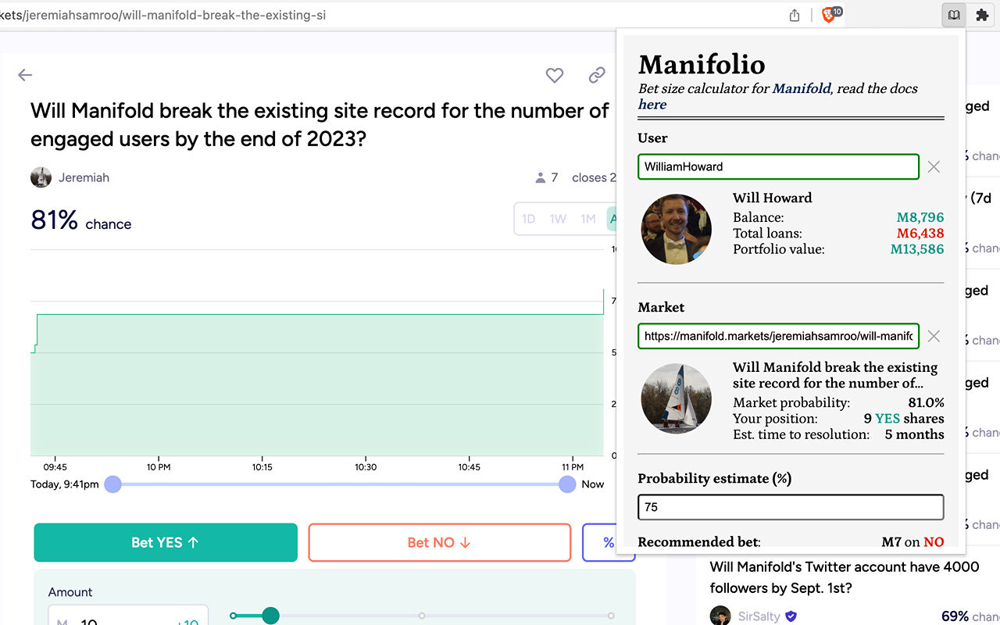

# Manifolio

Bet size calculator for YES/NO questions on [Manifold](https://Manifold.markets/). For a given probability, it calculates the optimal bet to place according to the [Kelly criterion](https://en.wikipedia.org/wiki/Kelly_criterion), i.e. maximising expected log(wealth).

[Go to site.](https://manifol.io/)

**Basic usage**

Input your **username**, the **url of the market** you want to bet on, and your **estimate of the true probability**. It will then tell you the amount to bet to maximise your log wealth, _given that your estimate is correct_.

You can put in your Manifold API key (found [here](https://Manifold.markets/profile) if you are logged in) to place bets via the calculator. This isn't necessary for it to work though, just the username is required (and you can even try other people's usernames for fun).



## Table of Contents
1. [Guide](#guide)
2. [Installing the Chrome extension](#installing-the-chrome-extension)
3. [Acknowledgements](#acknowledgements)

## Guide

_(Some of this is repeated from the intro above)_

The Kelly criterion has some nice properties which means it's probably the best strategy to use when making bets:

- Given a specific wealth goal, it minimises the expected time to reach that goal compared to any other strategy.
- It maximises wealth in the median outcome.
- A market where all participants bet according to the Kelly criterion learns at the optimal rate ([source](https://people.cs.umass.edu/~wallach/workshops/nips2011css/papers/Beygelzimer.pdf)).

There is a formula which can be used in the case of simple bets taken one at a time, with fixed odds:
```
f = p - q / b
```
 - f - The fraction of your bankroll to bet
 - p - The probability of a win
 - q - 1 - p
 - b - The odds of the market, in terms of "[english odds](https://www.investopedia.com/articles/investing/042115/betting-basics-fractional-decimal-american-moneyline-odds.asp)" in this case

This doesn't work that well on Manifold or other prediction markets, because:
 - A lot of markets are quite thinly traded, so the odds move a lot in response to your bet.
 - You bet on several things at the same time, so you don't have a fixed bankroll. You have a balance, plus a portfolio of other bets with have a range of possible outcomes.

This calculator accounts for those two things, plus some other stuff like how you should bet if you already have an open position on the market in question.

The exact calculation it's doing is maximising expected log wealth, assuming:
 - The only action you can take is to bet on the specific market you have entered
 - Your estimated probability is correct (accounting for the deferral factor, see below)
 - For all the other markets in your portfolio, the market probability is correct, and you will wait for them to resolve

So you're basically saying to it "Suppose I have one more action I can take on this earth, which is to bet on this specific market. After this I will walk away and wait until the end of time for every Manifold market to resolve. What sized bet should I make to maximise my expected log wealth in this scenario?"

### Basic usage

Input your **username**, the **url of the market** you want to bet on, and your **estimate of the true probability**. It will then tell you the amount to bet to maximise your log wealth, _given that your estimate is correct_.

You can put in your Manifold API key (found [here](https://Manifold.markets/profile) if you are logged in) to place bets via the calculator. This isn't necessary for it to work though, just the username is required (and you can even try other people's usernames for fun).

### Advanced usage

**Deferral factor**

There is also a **deferral factor** field in "Advanced options", which I would recommend you use (or at least I would recommend you leave it around 50%, which is the default).

When people use the Kelly formula in practice, they usually bet [some fixed fraction](https://www.lesswrong.com/posts/TNWnK9g2EeRnQA8Dg/never-go-full-kelly) of the recommended amount to be more risk averse. The deferral factor is exactly equivalent to this fraction. If a market had enough liquidity that the odds were effectively fixed, then a deferral factor of 50% would correspond to betting 50% of the Kelly formula amount.

The """bayesian""" interpretation of this number is that you are factoring in some chance that the market is right and you are wrong, so a deferral factor of 10% means you think there is a 10% chance you are right and a 90% chance that the market is right*. Or, equivalently again, that the actual probability to use in the calculation is 10% of the way between the market's estimate and your estimate. If this is all too confusing just remember that setting it to 100% will likely cause you to lose money by being overconfident, so you should probably leave it at some middling value.

**Mana overdraft**

Setting a Mana overdraft essentially sets the point which is considered "losing all your money" to a negative value, and so can allow you to accept some risk of ruin. You may want to do this if you have a lot of loans relative to your balance, which
will cause the calculator to either recommend a very low bet or or a bet of 0, although I'm not sure I would recommend it.

**Interpreting the "Expected return" numbers**

The "Expected return" numbers are very important. The calculation comes up with the best bet it can _on this specific market, given a certain edge, and a certain time to resolution_. It can't account for the opportunity cost of not betting on other markets that have more favourable odds. So if the time to resolution is very long or your edge over the market is very small you can still end up not doing that well.

The **"Expected return of this bet on it's own"** number is simply the _expected_ (not log) return of the bet, ignoring the rest of your portfolio, as an annualised percentage. It's the answer to the question "Suppose you found 1000 bets like this one and spread all your money across them, such that any variation gets averaged over to 0, what would your return be?". If you are betting on fairly illiquid markets then this is the more important number to look at, because the return from any one market will be quite small so you will have to rely on averaging over many of them.

_(Note: this number can be negative if you already have a position in the market which is in the right direction but too large (and possibly in other scenarios). This is technically correct, because it will tell you to bet in the opposite direction to sacrifice some expected value in return for an increase in expected log value of your entire portfolio. This is pretty confusing though, as the thought experiment of "suppose you found 1000 bets like this" breaks down if you are also supposing that all these bets are on markets you have a large position in already.)_

The **"Expected growth in entire portfolio due to this bet"** number is the expected log return of your entire portfolio as a result of the recommended bet (also as an annualised percentage). This is the number that the calculator is trying to maximise. If you are betting in very liquid markets (that can absorb a lot of mana without reaching your probability estimate), then this is the more useful number to look at.

### Things to watch out for/known issues

 - Selling positions is handled by buying the opposite side. So if you have YES shares in a market and you are now predicting a much lower probability, it will tell you to buy NO. This is equivalent to selling YES shares, and you do in fact get mana back when you do this. 1 NO + 1 YES share cancel out to produce M1.
 - The portfolio value and total loans might be off relative to what is in the Manifold UI. I think just this is due to caching issues, it should never be off by too much.
 - Currently it doesn't account for "Free response" or "Multiple choice" markets properly when simulating the range of possible outcomes, it just treats them as cash equal to their expected value. If you have a lot of money in these markets this will means the recommendation will be a bit too high (because it's ignoring some risk).
 - Complications related to the Manifold loan system: If you have outstanding loans greater than your total balance, the technically correct thing to do is to bet nothing. This is because log(0) is negative infinity, so any chance of ending up with 0 net worth gets an infinite penalty when maximising log wealth. This is pretty conservative though, as the chance of this happening can be vanishingly small if you have a reasonably diversified portfolio. If it were to follow this then for most power users it would recommend a bet of 0 which would rather defeat the point. Instead, I have made it treat the worst case as the _worst outcome that it actually simulates_ (out of 50,000 simulations), rather than the actual worst _possible_ case (which is every bet resolving against you).

## Installing the Chrome extension

The chrome extension prefills the market url based on the page you are on, which makes the whole thing a lot more convenient. Currently it's still being reviewed by Google for the web store, so if you want to install it you will have to follow these steps:

1. Download the `chrome-extension/` folder. The easiest way to do this is to download the whole repository with
```
git clone https://github.com/Will-Howard/manifolio.git
```
2. Go to [chrome://extensions/](chrome://extensions/) in your browser, make sure "Developer mode" (toggle in the top right) is enabled
3. Click "Load unpacked" and select the `chrome-extension/` folder that you have downloaded (just this folder, not the whole repo). It should then install the extension



<!-- ## Local setup

You can run the site locally like so:
```bash
git clone https://github.com/Will-Howard/manifolio.git
cd manifolio/manifolio-ui
yarn install
yarn dev
```

There are just two environment variables you might want to set (in a `.env` file or otherwise):
```
NEXT_PUBLIC_LOG_LEVEL=debug # "debug" | "info" | "warn" | "error", not yet used very consistently
NEXT_PUBLIC_Manifold_API_URL=http://localhost:3000 # or e.g. https://dev.Manifold.markets
```

These are the `node` and `yarn` versions I'm using in case you run into trouble:
```bash
$ node -v
v19.8.1
$ yarn -v
1.22.19
``` -->

## Acknowledgements

Thanks to the people who kindly funded this project on [Manifund](https://manifund.org/projects/a-tool-for-making-well-sized-kelly-optimal-bets-on-Manifold?tab=shareholders):
 - Patrick Purvis
 - Domenic Denicola
 - Tyler Heishman
 - Guenael Strutt
 - Austin Chen
 - Carson Gale
